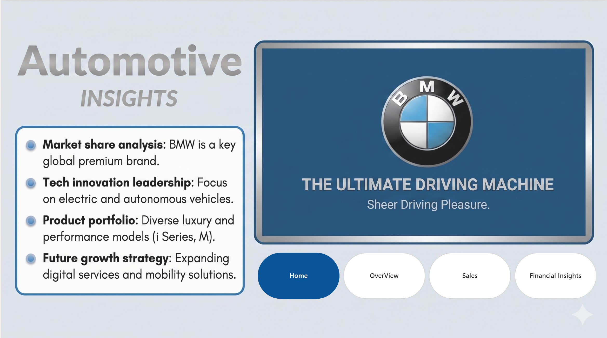
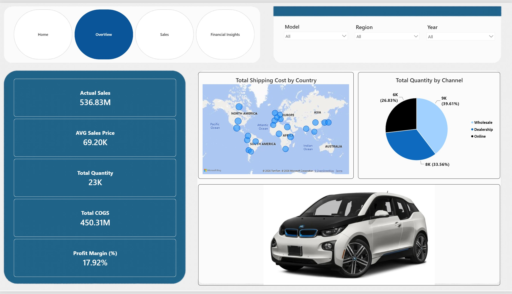
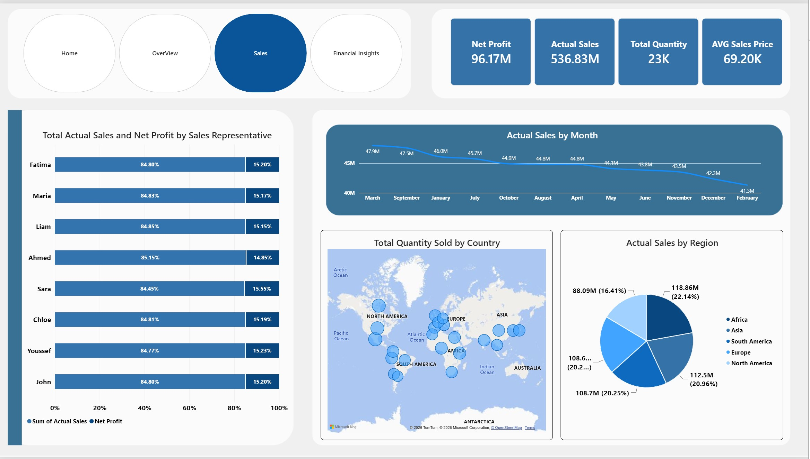
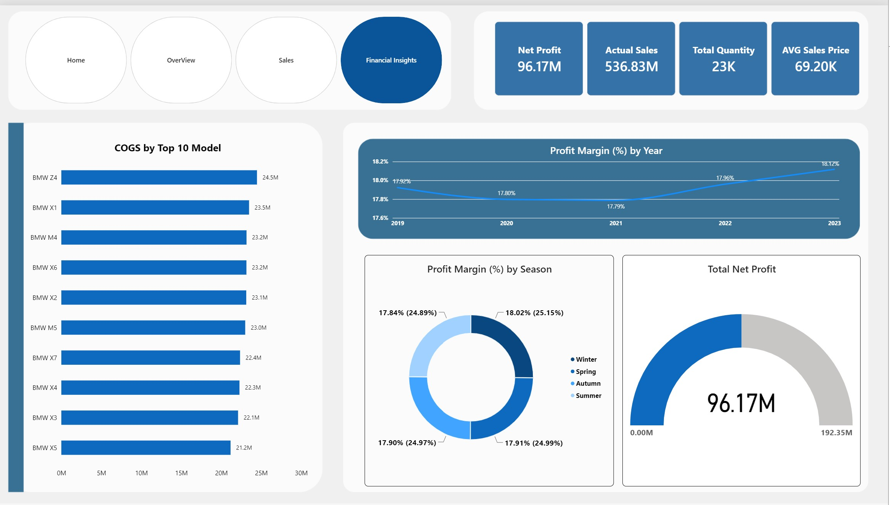

# 🚗 BMW Sales & Finance Analytics Dashboard

An interactive Power BI dashboard solution designed for comprehensive analysis of BMW's sales performance, financial health indicators, net profit margins, and distribution channel velocity. This project transforms raw operational data into high-impact corporate intelligence to help optimize dealership networks and forecast revenue growth.

---

## 📌 Project Overview
Sustaining premium market placement in the automotive industry requires deep coordination between sales metrics and financial margin management. This repository contains an end-to-end data pipeline built on BMW automotive datasets.

The dashboard integrates core transactional logs to evaluate regional sales performance, model-specific net margins, dealership volume distributions, and multi-variable financial health trends over time.

---

## 📂 Repository Structure
The project tracking files are organized systematically into dedicated folders as follows:

*   **`Dashboards/`**: Folder containing high-resolution interface captures and visualization layout snapshots (`1.jpg`, `2.jpg`, `3.jpg`, `4.jpg`).
*   **`Wallpaper/`**: Custom-built visual canvas backgrounds designed to keep the visual aesthetics professional and scannable.
*   **`BMW Data .xlsx`**: The underlying foundational Excel transaction database feeding the analytical pipeline.
*   **`BMW.pbix`**: The master Power BI Desktop application containing the data models, relationship structures, and dynamic dashboards.
*   **`BMW.pdf`**: A high-quality static report print export of the final dashboard pages for immediate portfolio viewing.

---

## 📄 View Full Report (PDF)
You can view or download the complete high-quality PDF version of the dashboard directly from this repository:

👉 **[Click Here to Open BMW.pdf](BMW.pdf)**

---

## 📸 Dashboard Previews
Explore the interactive pages of the BMW analytics solution directly below:

### 📊 Page 1: Overview Dashboard

### 📊 Page 2: Financial Analysis

### 📊 Page 3: Sales Performance

### 📊 Page 4: Distribution Channels

---

## 🚀 Key Features & Insights
*   **Macro Sales Performance Tracking**: Immediate visibility into aggregate dealership revenues, transaction volumes, and brand delivery velocities.
*   **Financial & Margin Analysis**: Dedicated calculations tracking gross profit vs. net profit margins across different vehicle tiers and series models.
*   **Distribution Channel Intelligence**: Slicing dealership efficiency to compare individual showroom sales against wholesale delivery distributions.
*   **Dynamic Slicers**: Interactive date tables and regional parameters providing instant cross-filtering for executive reviews.

---

## 🛠️ Tools & Technologies Used
*   **Power BI Desktop**: Structural data modeling, star schema formulation, and interactive storytelling dashboard layout deployment.
*   **Power Query**: Data preparation, handling missing financial variables, data format corrections, and robust ETL pipeline building.
*   **DAX (Data Analysis Expressions)**: Custom automotive KPI metrics, revenue contributions, profit margin aggregates, and time-intelligence calculations.
*   **Microsoft Excel**: Structured transaction data storage managing the core inventory database schemas.

---

## 🧑‍💻 Author
*   **Aya Khaled Mohamed**
    *   Data Analyst & Business Intelligence Specialist
    *   [LinkedIn Profile](https://www.linkedin.com/in/aya-k-mohamed-58474b2b7)
    *   [GitHub Profile](https://github.com/aya-khaled-mohamed)

---
*If you find this BMW sales and financial analytics portfolio project valuable, feel free to give this repository a ⭐ to show your support!*
